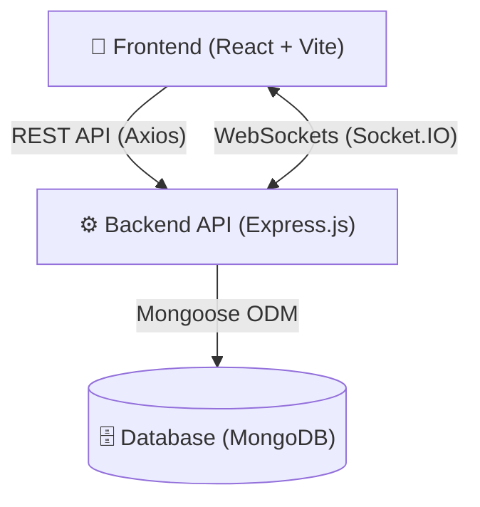
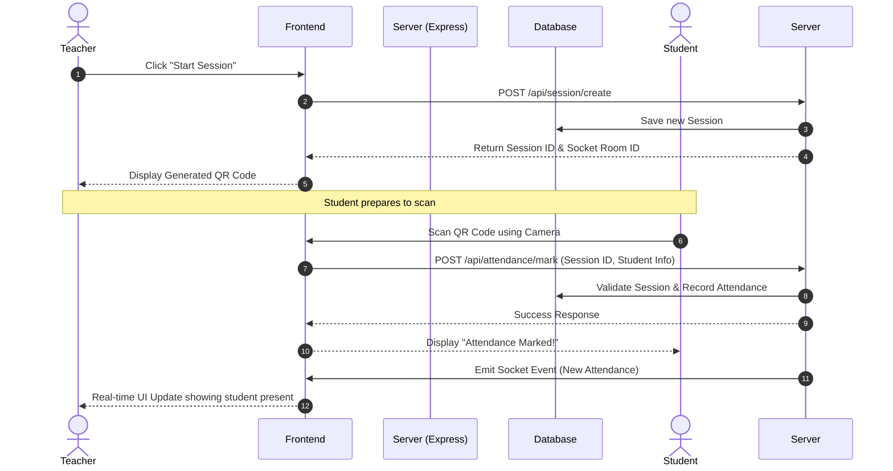

<div align="center">
  <h1>SmartAttend 📱🎓</h1>
  <p><strong>A Modern, Full-Stack Real-Time Smart Attendance System</strong></p>
  
  
  
  
  
  
  
</div>

---

SmartAttend streamlines the process of tracking student attendance using dynamically generated QR codes and seamless WebSocket connections. It provides an intuitive interface for teachers to manage sessions and for students to mark their presence securely and instantly.

## 🚀 Key Features

- 🔐 **Secure Authentication**: Supports both Local (JWT-based) authentication and Google OAuth 2.0 integration.
- 📸 **QR Code Attendance**: Teachers generate session-specific QR codes, and students scan them using their device's camera to mark presence securely.
- ⚡ **Real-Time Updates**: Live dashboard updates for teachers when students mark their attendance, powered by Socket.IO.
- 📊 **Session & History Management**: Complete workflows for creating attendance sessions, viewing analytics, and tracking individual student history.
- 🛡️ **Robust Security**: Hardened with API rate-limiting, Helmet for secure HTTP headers, HPP protection, and comprehensive input validation via Zod and express-validator.

---

## 🏗️ Technology Stack

### Frontend (Client)
- **Framework**: React 19 + Vite
- **Styling**: Tailwind CSS v4
- **Routing**: React Router v7
- **Networking & Real-time**: Axios, Socket.IO Client
- **Utilities**: `html5-qrcode` & `qrcode.react` for reliable QR scanning and generation.

### Backend (Server)
- **Framework**: Express.js v5 (Node.js)
- **Database**: MongoDB with Mongoose ODM
- **Authentication**: Passport.js (Google OAuth), JSON Web Tokens (JWT), bcrypt for password hashing
- **Real-time**: Socket.IO
- **Validation**: Zod (Env validation), express-validator (Request body)
- **Logging**: Pino & Morgan

---

## 📊 System Architecture

The application follows a standard client-server architecture with a real-time bi-directional communication layer.



---

## 🔄 Core Workflow (Attendance Flow)

The primary flow of the application involves a Teacher creating a session, and a Student marking their attendance in real-time.



---

## 📁 Project Structure

```text
SmartAttend/
├── frontend/               # React + Vite Client Application
│   ├── src/                # Components, Pages, Context, Hooks
│   ├── public/             # Static Assets
│   ├── package.json        # Frontend Dependencies
│   └── vite.config.js      # Vite Configuration
│
└── sever/                  # Express.js Backend API
    ├── src/
    │   ├── config/         # Environment & Logger configuration
    │   ├── database/       # MongoDB Connection
    │   ├── middlewares/    # Security, Error Handling, OAuth
    │   ├── models/         # Mongoose Schemas (User, Session, Attendance)
    │   ├── modules/        # Domain specific routes/controllers/services
    │   ├── repository/     # Database operations layer
    │   └── utils/          # Helper functions (Token gen, Async handlers)
    ├── server.js           # Server Entry Point
    └── package.json        # Backend Dependencies
```

---

## 🛠️ Getting Started

### Prerequisites
- [Node.js](https://nodejs.org/) (v18 or higher)
- [MongoDB](https://www.mongodb.com/) (Local instance or Atlas URI)

### 1. Environment Variables Configuration
Navigate to the `sever` directory and create a `.env` file using the following template:

```env
PORT=3000
MONGO_URL=mongodb://127.0.0.1:27017/smartattend
GOOGLE_CALLBACK_URL=http://localhost:3000/api/user/google/callback
GOOGLE_CLIENT_ID=your_client_id
GOOGLE_CLIENT_SECRET=your_client_secret
ACCESSTOKEN=thisisuseforaccesstokegeneration
REFRESHTOKEN=thisisuseforrefreshtokegeneration
```
*(Make sure to replace the placeholder values with actual secrets in production)*

### 2. Backend Setup
Install dependencies and start the server:

```bash
cd sever
npm install
npm start
```
*The server typically runs on `http://localhost:3000`.*

### 3. Frontend Setup
Open a new terminal, navigate to the `frontend` directory, install dependencies, and run the development server:

```bash
cd frontend
npm install
npm run dev
```
*The client will start on the Vite default port (e.g., `http://localhost:5173`).*

---

## 🧪 Testing & Validation
The backend includes integration tests to verify API endpoints and core flows. You can manually test the flow by running:

```bash
# Example test script execution (if available)
node sever/testAttendanceFlow.js
```

---